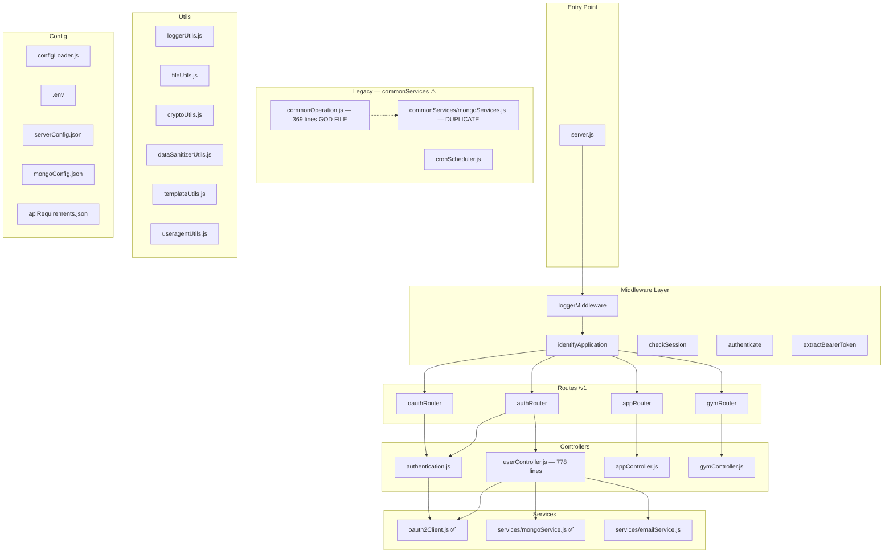
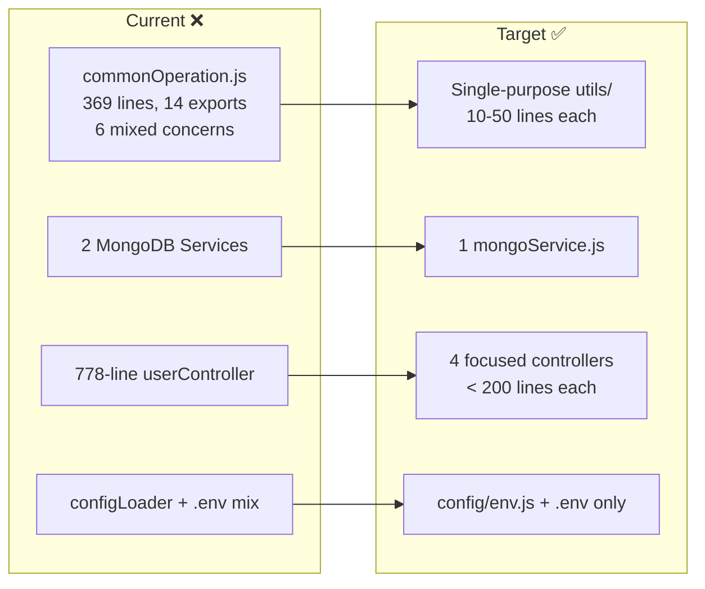

# Workspace Platform Backend — Architecture & Refactoring Analysis

## Current Architecture



---

## 🔴 Critical Issues Found

### 1. `commonOperation.js` — God File (369 lines, 14 exports)

This single file mixes **6 unrelated concerns**:

| Concern | Functions | Already Exists Separately? |
|---------|-----------|---------------------------|
| File encryption | `encryptJsonFile`, `decryptJsonFile`, `readJsonFiles` | `utils/fileUtils.js` ✅ |
| Email sending | `emailAuth`, `sendEmail` | `services/emailService.js` ✅ |
| JWT token ops | `generateTokens`, `getNewAccessToken`, `validateAccessToken` | `authentication.js` ✅ |
| Logging | `setupLogger`, `logWarning`, `logError`, `logInfo` | `utils/loggerUtils.js` ✅ |
| Input validation | `validateLength`, `validatePattern`, `requestDataInjectionCheck` | None |
| Array utils | `intersection` | None |

> [!CAUTION]
> **Hardcoded encryption key** on line 9: `QHlPYy2x4kPbWThoF63YXs9x345EmfgjQK7nsvfC2H0=`
> This should be in `.env` or a secrets manager.

**Recommendation:** Delete `commonOperation.js` after migrating its 2 unique functions (`requestDataInjectionCheck`, `intersection`) to `utils/validationUtils.js`.

---

### 2. Duplicate MongoDB Services

| File | Style | Used By |
|------|-------|---------|
| `services/mongoService.js` | Singleton, lazy init, cleaner API | `userController.js`, `appController.js` |
| `commonServices/mongoServices.js` | Class, eager connect, older API | `commonOperation.js` (email retry) |

**Recommendation:** Keep `services/mongoService.js`. Delete `commonServices/mongoServices.js`.

---

### 3. `userController.js` — 778 Lines, Multiple Responsibilities

This controller handles:
- User registration
- User login (local auth)
- Session creation (`/auth/me`)
- Logout
- Google OAuth callback
- Password reset
- Profile updates

**Recommendation:** Split into feature controllers:

```
controllers/v1/auth/
├── sessionController.js    ← createSession, logoutUser
├── authController.js       ← loginUser, registerUser
├── passwordController.js   ← resetPassword, changePassword
└── profileController.js    ← updateProfile, getProfile
```

---

### 4. Configuration Inconsistency

Currently using **two systems** simultaneously:

| Source | Used For |
|--------|----------|
| `configLoader.js` → JSON files | PORT, CORS, SMTP, MongoDB, API requirements |
| `process.env` → `.env` file | OAuth2 credentials, NODE_ENV |

**Recommendation:** Migrate all sensitive/environment-specific values to `.env`. Keep JSON configs only for static app configuration (API field schemas, UI templates).

---

### 5. `server.js` — Hardcoded Values

```javascript
// ❌ Current
origin: ['https://myomspanel.onrender.com', 'http://localhost:5173']

// ✅ Should be
origin: process.env.CORS_ORIGINS.split(',')
// .env: CORS_ORIGINS=http://localhost:5173,https://myomspanel.onrender.com
```

---

### 6. No Centralized Response Handler

Response shapes vary across controllers:
```javascript
// Style 1
res.status(200).json({ success: true, message: '...' })
// Style 2  
res.status(200).json({ "success": true, "message": "..." })
// Style 3
res.status(500).send('Something went wrong!')
```

**Recommendation:** Create `utils/responseHandler.js`.

---

## 📁 Proposed Folder Structure

```
src/
├── server.js                          # Entry point (slim)
├── config/
│   ├── env.js                         # Centralized env validation
│   ├── apiRequirements.json           # Field schemas (static)
│   ├── mongoConfig.json               # DB connection (→ migrate to .env later)
│   └── serverConfig.json              # App config (non-sensitive)
│
├── middlewares/
│   ├── identifyApplication.js
│   ├── auth.js                        # extractBearerToken + authenticate
│   └── logger.js
│
├── routes/v1/
│   ├── authRouter.js
│   ├── oauthRouter.js
│   ├── appRouter.js
│   └── gymRouter.js
│
├── controllers/v1/
│   ├── auth/
│   │   ├── authController.js          # login, register
│   │   ├── sessionController.js       # createSession, logoutUser
│   │   └── authentication.js          # generateTokens, validateToken
│   ├── app/
│   │   └── appController.js
│   └── gym/
│       └── gymController.js
│
├── services/
│   ├── mongoService.js                # Single MongoDB service
│   ├── emailService.js                # Single email service
│   └── oauth2Client.js                # OAuth2 server communication
│
├── utils/
│   ├── responseHandler.js             # NEW — success(), error()
│   ├── validationUtils.js             # NEW — from commonOperation.js
│   ├── loggerUtils.js
│   ├── cryptoUtils.js
│   ├── dataSanitizerUtils.js
│   ├── templateUtils.js
│   ├── fileUtils.js
│   └── useragentUtils.js
│
└── public/
    └── index.html
```

**Deleted:**
- `commonServices/` — entire directory (god file + duplicate mongo)
- `configLoader.js` — replaced by `config/env.js` + direct `process.env`
- `cornScheduler.js` — typo filename, merged into proper scheduler if needed

---

## 🗺️ Refactoring Roadmap

### Phase 1 — Quick Wins (Low Risk)
- [ ] Move CORS/PORT to `process.env` in `server.js`
- [ ] Create `utils/responseHandler.js`
- [ ] Move hardcoded encryption key to `.env`
- [ ] Remove dead/commented-out code

### Phase 2 — Eliminate Duplicates
- [ ] Delete `commonServices/mongoServices.js` (unused)
- [ ] Delete duplicate email/logging/JWT functions from `commonOperation.js`
- [ ] Migrate `requestDataInjectionCheck` to `utils/validationUtils.js`
- [ ] Delete `commonServices/commonOperation.js`

### Phase 3 — Split Controllers  
- [ ] Extract `sessionController.js` from `userController.js`
- [ ] Extract Google OAuth callback handler
- [ ] Ensure each controller < 200 lines

### Phase 4 — Unify Configuration
- [ ] Create `config/env.js` that validates all required env vars at startup
- [ ] Migrate MongoDB config to `.env`
- [ ] Migrate SMTP config to `.env`
- [ ] Remove `configLoader.js` (keep JSON only for static API field schemas)

---

## Dependencies Audit

| Package | Status | Notes |
|---------|--------|-------|
| `crypto` | ⚠️ **Remove** | Built-in Node.js module, npm package is deprecated |
| `http-status` + `http-status-codes` | ⚠️ **Pick one** | Two packages for the same thing |
| `jose` + `jsonwebtoken` + `jwk-to-pem` | ⚠️ Review | `jose` alone can handle all JWT ops |
| `fernet` | ❓ | Check if still used |
| `util` | ⚠️ **Remove** | Built-in, no npm install needed |
| `passport` + `passport-google-oauth20` | ✅ Keep | Used for Google SSO |

---

## Current vs Target Architecture


